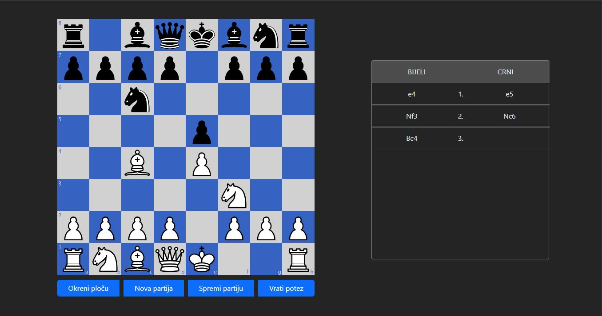
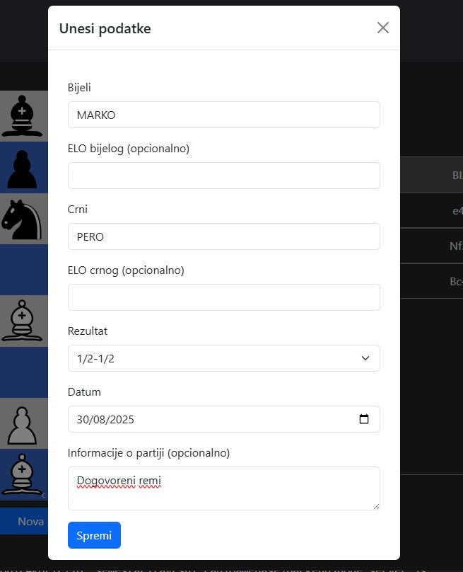
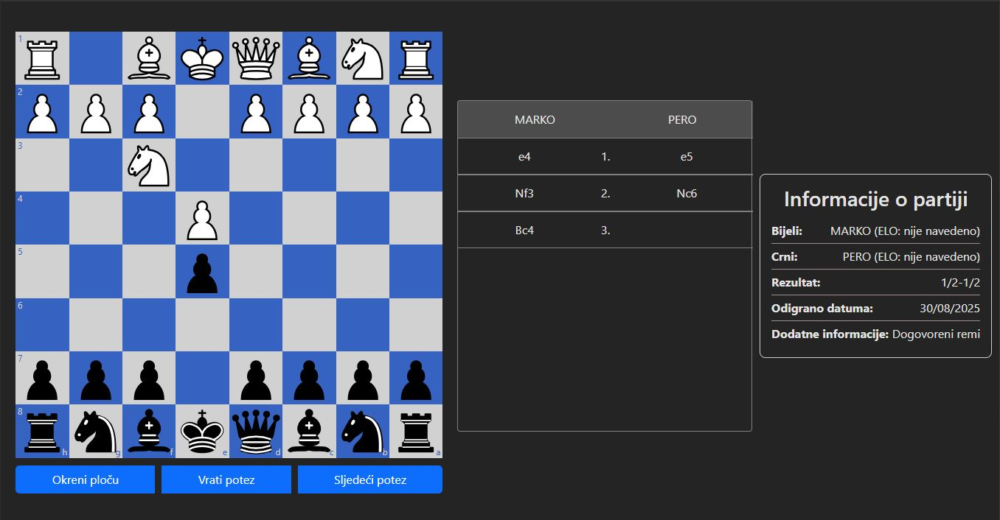

# Chess Database

Aplikacija za unos i pregled šahovskih partija, razvijena kao završni rad na preddiplomskom studiju na Fakultetu elektrotehnike i računarstva u Zagrebu.

Aplikacija koristi React za frontend i Node.js s Expressom za backend, dok se podaci pohranjuju lokalno u PostgreSQL bazu.

---

## Tehnologije

- React  
- Node.js, Express.js  
- PostgreSQL  
- Bootstrap, CSS
 

---

## Korištene biblioteke

- `react-chessboard` — za prikaz šahovske ploče  
- `chess.js` — za validaciju poteza i logiku igre  

---

## Kako pokrenuti aplikaciju lokalno

### Backend

1. Otvori terminal i pozicioniraj se u folder `/backend/src`  
2. Pokreni server naredbom:  
   ```bash
   node server.js

### Frontend

1. Otvori terminal i pozicioniraj se u folder `/frontend/GameBase/src/App`
2. Instaliraj potrebne pakete naredbom:
   ```bash
   npm install
3. Pokreni server naredbom:  
   ```bash
   npm run dev

Aplikacija će biti dostupna na adresi: http://localhost:5173/ 

---

### Izgled aplikacije prilikom unošenja partije


Nakon svakog poteza,potez se u zapisuje u prozor pored ploče, te se partija sprema pritiskom na tipku "Spremi partiju". Također je moguće okretati ploču, odnosno moguće je gledati na ploču iz perspektive bijelog i crnog igrača.

### Izgled forme za unos informacija o partiji


Prilikom spremanja partije, otvara se forma prikazana na slici, obavezne informacije su ime bijelog i crnog igrača, rezultat te datum kada je partija odigrana.

### Izgled aplikacije pri pregledavanju određene partije


Pri pregledu partije, cijela partija prikazana je u prozoru pored ploče, te se potezi jedan po jedan odigravaju prilikom pritiska gumba "Sljedeći potez" ili "Vrati potez". Pored prozora s potezima, prikazane su informacije o partiji.
